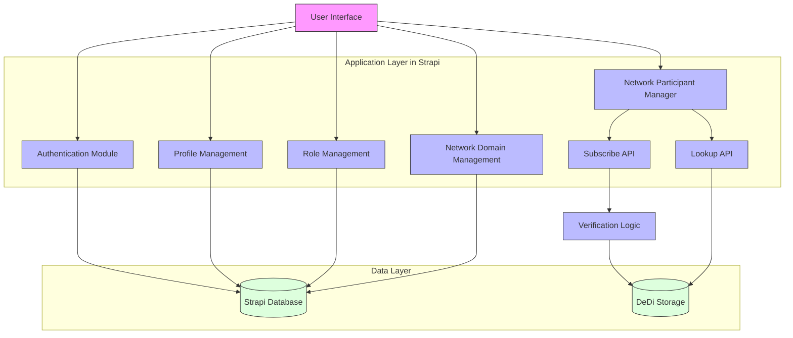

# Network Registry Logical Architecture

## Logical Architecture Diagram

## Architecture Components

### 1. Presentation Layer

- **User Interface (UI)**
  - Web-based interface for registry management
  - Access to all registry functionalities
  - Role-based access control
  - Intuitive participant management

### 2. Application Layer (Strapi)

#### Core Modules

- **Authentication Module**

  - User authentication and authorization
  - Session management
  - Security token handling
  - Access control implementation

- **Profile Management**

  - User profile handling
  - Profile updates and verification
  - User preferences management
  - Contact information management

- **Network Participant Manager**

  - Participant registration
  - Status management
  - Verification coordination
  - Participant lifecycle management

- **Role Management**

  - Role definition and assignment
  - Permission management
  - Access level control
  - Role hierarchy management

- **Network Domain Management**
  - Domain registration
  - Domain verification
  - Schema management
  - Domain status tracking

#### API Components

- **Subscribe API**

  - New participant registration
  - Verification process handling
  - Security validation
  - Key management

- **Lookup API**

  - Participant discovery
  - Filtered searches
  - Record retrieval
  - Response formatting

- **Verification Logic**
  - SSL verification
  - Domain verification
  - Challenge-response handling
  - Security checks

### 3. Data Layer

- **Strapi Database**

  - User data storage
  - Profile information
  - Role configurations
  - Domain registrations
  - Relational data management

- **DeDi Storage**
  - Participant records
  - Verification status
  - Public keys
  - Network metadata
  - Distributed storage system

## Data Flow

1. **User Operations**

   - UI interactions trigger module functions
   - Authentication checks for all operations
   - Role-based access enforcement

2. **Participant Management**

   - Registration through NPManager
   - Verification via Subscribe API
   - Storage in DeDi system

3. **Lookup Operations**

   - Search requests through UI
   - Processing by Lookup API
   - Data retrieval from DeDi

4. **Administrative Functions**
   - Role and domain management
   - Direct database operations
   - Configuration management

## Security Considerations

1. **Authentication**

   - Secure token management
   - Session handling
   - Access control

2. **Data Protection**

   - Encrypted storage
   - Secure communication
   - Data integrity checks

3. **API Security**
   - Request validation
   - Rate limiting
   - Security headers
