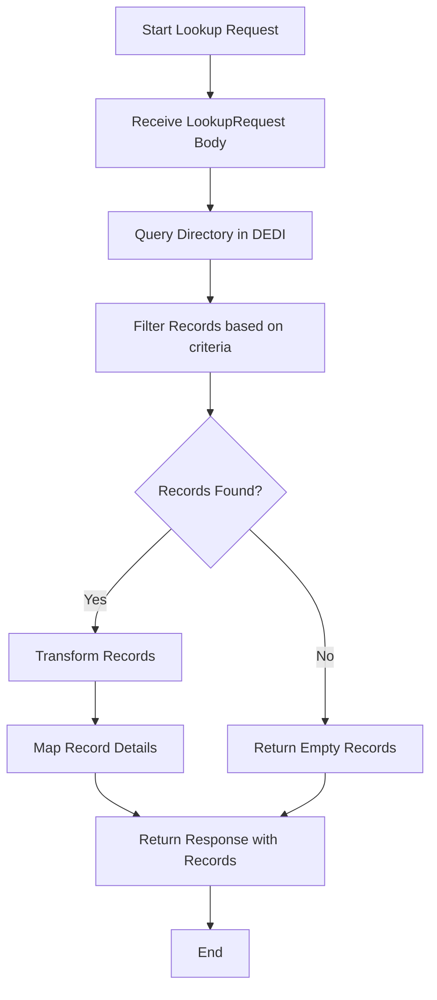

# Registry Lookup API Flow

## Flow Diagram



## Flow Description

1. **Start Lookup Request**

   - API endpoint receives a request to lookup network participants
   - Request can include optional filter parameters: type, status, and domain

2. **Receive LookupRequest Body**

   - System validates and processes the incoming request body
   - Extracts filter criteria if provided in the request

3. **Query Directory in DEDI**

   - Makes a call to DEDI (Decentralized Directory) service
   - Queries the 'network-subscribers' registry
   - Uses the namespace defined in environment (default: 'fide.org.temp')

4. **Filter Records Based on Criteria**

   - Applies filters on the retrieved records:
     - Type filter: Matches records with specified participant type
     - Status filter: Matches records with specified status
     - Domain filter: Matches records with specified domain

5. **Records Found Decision**

   - System checks if any records match the filter criteria
   - Branches based on presence of matching records

6. **Transform Records (If Found)**

   - Processes each matching record
   - Extracts relevant information for response

7. **Map Record Details**

   - Maps each record to include:
     - Status
     - Type
     - Domain
     - Signing Public Key
     - Subscriber ID
     - Unique Key ID
     - Valid Until
     - Subscriber URL
     - Created Date
     - Valid From
     - Encryption Public Key
     - Updated Date

8. **Return Response**

   - For found records: Returns mapped records with details
   - For no records: Returns empty record array
   - Includes original response from DEDI

9. **End**
   - Request processing completes
   - Response sent back to client

## Error Handling

- Any errors during the process are caught
- Error messages are logged
- 400 Bad Request status returned with error message

## Response Format

```json
{
  [
    {
      "status": "string",
      "type": "string",
      "domain": "string",
      "signing_public_key": "string",
      "subscriber_id": "string",
      "unique_key_id": "string",
      "valid_until": "string",
      "subscriber_url": "string",
      "created": "string",
      "valid_from": "string",
      "encr_public_key": "string",
      "updated": "string"
    }
  ]
}
```
