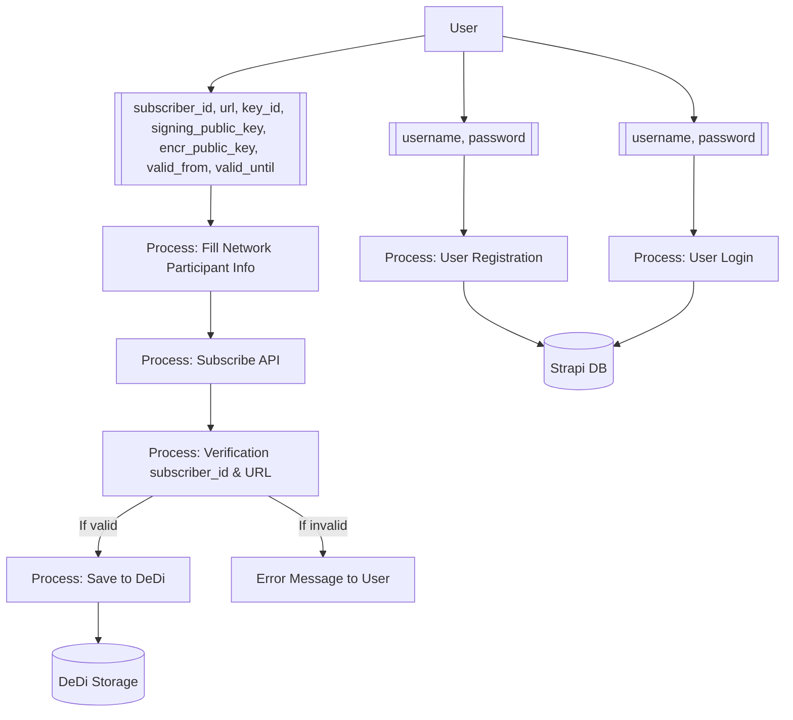

# User and Network Participant Onboarding Flow

## Overview

This diagram illustrates the complete flow of user registration and network participant onboarding in the registry system. It shows the interaction between users, processes, and data stores, highlighting the key data flows and validation steps.

## Data Flow Diagram

## Components Description

### 1. External Entities

- **User**: The end-user interacting with the system
  - Provides registration information
  - Submits network participant details
  - Receives system responses

### 2. Data Inputs

- **User Authentication**

  - Username
  - Password

- **Network Participant Details**
  - subscriber_id: Unique identifier
  - url: Participant endpoint
  - key_id: Key identifier
  - signing_public_key: For digital signatures
  - encr_public_key: For encryption
  - valid_from: Start of validity period
  - valid_until: End of validity period

### 3. Processes

- **User Registration**

  - Validates user inputs
  - Creates user account
  - Stores credentials securely

- **User Login**

  - Authenticates user
  - Creates session
  - Manages access rights

- **Network Participant Form**

  - Collects participant information
  - Validates input format
  - Prepares for API submission

- **Subscribe API**

  - Processes participant registration
  - Initiates verification
  - Handles responses

- **Verification**

  - Validates subscriber_id
  - Checks URL accessibility
  - Verifies credentials

- **DeDi Storage**
  - Saves verified participants
  - Updates participant status
  - Maintains records

### 4. Data Stores

- **Strapi Database**

  - Purpose: User management and authentication
  - Stores:
    - User profiles
    - Authentication data
    - Session information
    - Access rights

- **DeDi Storage**
  - Purpose: Network participant management
  - Stores:
    - Participant records
    - Public keys
    - Verification status
    - Domain information

## Process Flows

### 1. User Registration Flow

1. User provides username and password
2. Registration process validates inputs
3. Creates user record in Strapi DB
4. Returns confirmation/error

### 2. User Login Flow

1. User submits credentials
2. Login process verifies with Strapi DB
3. Creates user session
4. Grants system access

### 3. Participant Registration Flow

1. User submits participant details
2. Form process validates inputs
3. Subscribe API initiates verification
4. If valid:
   - Saves to DeDi storage
   - Returns success
5. If invalid:
   - Returns error message
   - Allows correction

## Error Handling

### 1. Input Validation Errors

- Missing required fields
- Invalid format
- Duplicate entries

### 2. Process Errors

- Registration failures
- Verification issues
- Storage problems

### 3. System Errors

- Database connection issues
- API failures
- Network problems

## Security Measures

### 1. Data Protection

- Encrypted password storage
- Secure communication
- Input sanitization

### 2. Access Control

- Session management
- Role-based access
- Authentication checks

### 3. Process Security

- Validation at each step
- Error logging
- Audit trailing
