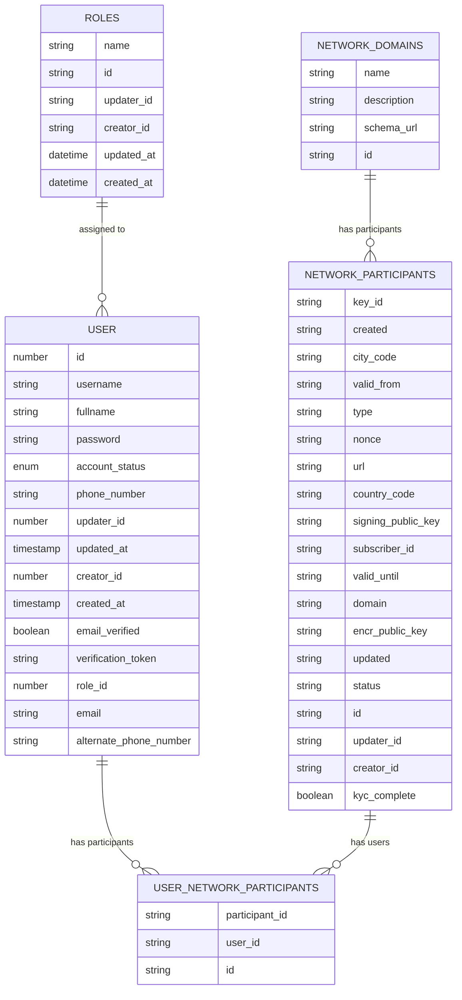

## Entity Relationship Diagram

## Schema Diagram



## Entity Descriptions

### 1. USER

- Primary entity for storing user information
- **Key Fields**:
  - `id`: Unique identifier for the user
  - `username`: User's login name
  - `fullname`: User's full name
  - `email`: Primary email address
  - `account_status`: Current status of the account (enum)
  - `role_id`: Reference to assigned role
- **Verification Fields**:
  - `email_verified`: Email verification status
  - `verification_token`: Token for email verification
- **Contact Information**:
  - `phone_number`: Primary contact number
  - `alternate_phone_number`: Secondary contact number
- **Audit Fields**:
  - `creator_id`: User who created the record
  - `updater_id`: User who last updated the record
  - `created_at`: Creation timestamp
  - `updated_at`: Last update timestamp

### 2. ROLES

- Manages role definitions and permissions
- **Key Fields**:
  - `id`: Unique role identifier
  - `name`: Role name/title
- **Audit Fields**:
  - `creator_id`: Role creator
  - `updater_id`: Last modifier
  - `created_at`: Creation time
  - `updated_at`: Last update time

### 3. NETWORK_PARTICIPANTS

- Represents network participants/subscribers
- **Identification**:
  - `id`: Unique identifier
  - `key_id`: Unique key identifier
  - `subscriber_id`: Subscriber identifier
- **Security Keys**:
  - `signing_public_key`: For digital signatures
  - `encr_public_key`: For encryption
  - `nonce`: Security nonce value
- **Location Info**:
  - `city_code`: City identifier
  - `country_code`: Country identifier
  - `domain`: Participant's domain
  - `url`: Participant's endpoint
- **Temporal Fields**:
  - `valid_from`: Validity start date
  - `valid_until`: Validity end date
  - `created`: Creation timestamp
  - `updated`: Last update timestamp
- **Status Fields**:
  - `status`: Current participant status
  - `type`: Participant type
  - `kyc_complete`: KYC verification status

### 4. USER_NETWORK_PARTICIPANTS

- Junction table linking users and network participants
- **Fields**:
  - `id`: Unique identifier
  - `user_id`: Reference to USER
  - `participant_id`: Reference to NETWORK_PARTICIPANTS

### 5. NETWORK_DOMAINS

- Manages network domains configuration
- **Fields**:
  - `id`: Unique identifier
  - `name`: Domain name
  - `description`: Domain description
  - `schema_url`: URL to domain schema

## Relationships

1. **User-Role Relationship**

   - One role can be assigned to many users
   - Each user has one role
   - Relationship: One-to-Many

2. **User-Participant Relationship**

   - Users can be associated with multiple network participants
   - Network participants can have multiple users
   - Many-to-Many relationship through USER_NETWORK_PARTICIPANTS

3. **Domain-Participant Relationship**
   - One domain can have multiple participants
   - Each participant belongs to one domain
   - One-to-Many relationship

## Data Integrity

1. **Audit Trail**

   - All entities track creation and updates
   - Maintains creator and updater information
   - Timestamps for all changes

2. **Status Management**

   - Account status tracking
   - Email verification status
   - KYC completion status
   - Participant status tracking

3. **Security Features**
   - Password encryption
   - Verification tokens
   - Public key management
   - Domain validation

```

```
