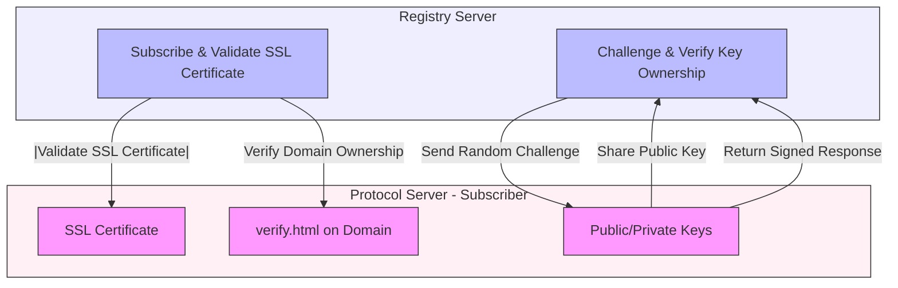

# Network Registry Security Architecture

## Architecture Diagram

## Architecture Description

1. **Registry Server Components**

   - **Subscribe & Validate SSL Certificate**

     - Entry point for new participant registration
     - Handles SSL certificate validation
     - Verifies domain ownership
     - Ensures secure communication

   - **Challenge & Verify Key Ownership**
     - Manages challenge-response protocol
     - Verifies key ownership
     - Validates digital signatures
     - Ensures participant authenticity

2. **Protocol Server - Subscriber Components**

   - **SSL Certificate**

     - Provides secure communication
     - Enables HTTPS endpoints
     - Ensures data encryption
     - Prevents man-in-the-middle attacks

   - **verify.html on Domain**

     - Proves domain ownership
     - Static file verification
     - Domain control validation
     - Prevents unauthorized registrations

   - **Public/Private Keys**
     - Manages cryptographic keys
     - Signs challenge responses
     - Enables secure communication
     - Ensures participant authenticity

## Security Flow

1. **SSL Certificate Validation**

   - Registry server requests SSL certificate
   - Validates certificate authenticity
   - Checks certificate expiration
   - Verifies certificate chain

2. **Domain Ownership Verification**

   - Registry checks verify.html presence
   - Validates file content
   - Confirms domain control
   - Prevents domain spoofing

3. **Key Ownership Verification**
   - Subscriber shares public key
   - Registry generates random challenge
   - Subscriber signs with private key
   - Registry verifies signature
