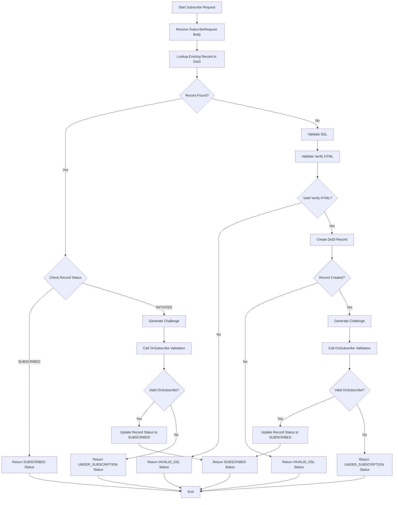

# Network Registry Subscribe Flow

## Overview

The Subscribe Flow manages the registration and verification of new network participants in the registry. This process ensures secure and validated participant onboarding through multiple verification steps.

## Flow Diagram

## Process Description

### 1. Initial Request Processing

- **Start Subscribe Request**: Entry point for new participant registration
- **Receive SubscribeRequest Body**:
  - Validates incoming request data
  - Contains participant details, domain, and public keys

### 2. Record Verification

- **Lookup Existing Record**:
  - Checks DeDi storage for existing participant
  - Uses composite key: `${subscriber_id}-${domain}`

### 3. Existing Record Handling

If record exists:

- **Check Record Status**:
  - SUBSCRIBED: Return existing subscription
  - INITIATED: Proceed with validation

### 4. New Registration Process

If no record exists:

1. **SSL Validation**:

   - Verifies SSL certificate
   - Ensures secure communication
   - Validates certificate authenticity

2. **Domain Verification**:

   - Checks verify.html presence
   - Validates domain ownership
   - Ensures authorized registration

3. **DeDi Record Creation**:
   - Creates new participant record
   - Stores initial status as INITIATED
   - Maintains participant metadata

### 5. Challenge-Response Validation

- **Generate Challenge**:

  - Creates random challenge string
  - Uses for participant verification

- **OnSubscribe Validation**:
  - Calls participant's endpoint
  - Verifies challenge response
  - Validates signing capabilities

### 6. Status Management

Final states:

- **SUBSCRIBED**: Successfully registered
- **INVALID_SSL**: SSL/Domain verification failed
- **UNDER_SUBSCRIPTION**: Validation incomplete

## Status Transitions

1. **Initial State**

   - New request → INITIATED

2. **Verification States**

   - SSL Invalid → INVALID_SSL
   - Domain Invalid → INVALID_SSL
   - Challenge Failed → UNDER_SUBSCRIPTION

3. **Final States**
   - Success → SUBSCRIBED
   - Failure → INVALID_SSL/UNDER_SUBSCRIPTION

## Error Handling

1. **SSL Validation Errors**

   - Certificate missing
   - Invalid certificate
   - Expired certificate

2. **Domain Verification Errors**

   - verify.html not found
   - Invalid file content
   - Access denied

3. **Challenge Response Errors**
   - Invalid signature
   - Timeout
   - Connection failure

## Security Measures

1. **Transport Security**

   - Mandatory SSL validation
   - Secure communication channel
   - Certificate verification

2. **Domain Security**

   - Domain ownership verification
   - File-based validation
   - Access control checks

3. **Cryptographic Security**
   - Challenge-response mechanism
   - Public key validation
   - Signature verification

## Best Practices

1. **Validation**

   - Multiple verification steps
   - Comprehensive security checks
   - Status tracking

2. **Error Management**

   - Clear error states
   - Detailed error messages
   - Proper status codes

3. **Security**
   - Cryptographic verification
   - Domain validation
   - Secure communication
